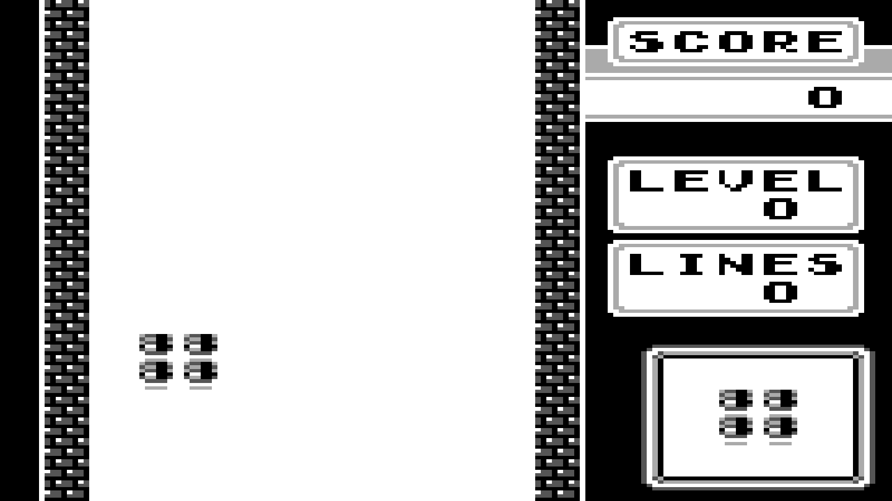

# gb

This is a Game Boy emulator that I wrote, to see if assigning a Game Boy emulator was feasible for an experimental class that I taught.

Spoiler: it wasn't, and I went with CHIP-8 instead. So I'm putting this code up here.

This emulator doesn't support sound or any of the mapper chips. Sprites also look a little weird.
